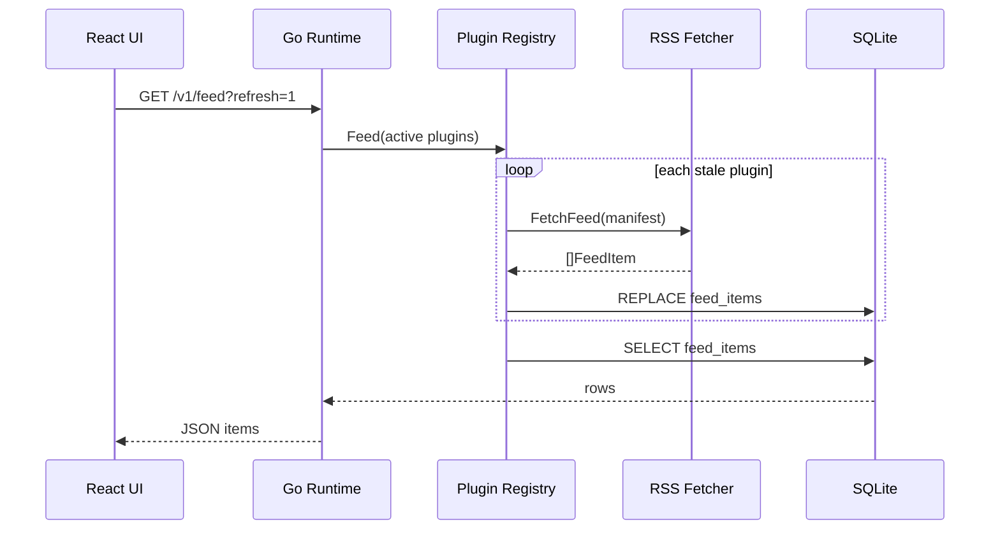

# RSS 插件支持方案

本文档描述 Orbit Reader **Phase 1** 的 RSS 插件体系：声明式 manifest、Go 原生解析、SQLite 缓存与 REST API。

## 设计原则

1. **RSS 不需要 JS**：`source: "rss"` 的插件仅含 `manifest.json`，由 Go 直接拉取并解析 Feed。
2. **统一契约**：无论未来是 RSS、Goja 脚本还是 WASM，对外都暴露相同的 capability（Phase 1 仅 `feed`）。
3. **缓存优先**：Feed 条目写入 SQLite，按 `refreshInterval` 增量刷新，网络失败时降级读缓存。
4. **目录可扩展**：内置插件与用户导入插件分目录存放，扫描时用户目录优先。

## 目录结构

```text
plugins/                          # 内置 RSS 插件（开发 / 打包）
  verge-rss/manifest.json
  techcrunch-rss/manifest.json
  wired-rss/manifest.json

~/Library/Application Support/Orbit Reader/
  orbit.db                        # plugins + feed_items 表
  plugins/                        # 用户导入的 RSS（自动生成 manifest）
    rss-abc123/manifest.json

runtime/internal/
  plugin/                         # Registry、RSS 解析、manifest 校验
  store/                          # SQLite 读写
  server/                         # HTTP API
```

## manifest.json Schema

```json
{
  "id": "verge-rss",
  "name": "The Verge",
  "version": "1.0.0",
  "mediaType": "article",
  "source": "rss",
  "capabilities": ["feed"],
  "config": {
    "refreshInterval": 3600,
    "userAgent": "",
    "channels": [
      {
        "id": "main",
        "label": "全部",
        "feedUrl": "https://www.theverge.com/rss/index.xml"
      }
    ]
  },
  "meta": {
    "description": "科技评论与前沿快讯",
    "color": "bg-cyan-500",
    "logoText": "V",
    "marketCategory": "news",
    "categoryTag": "NEWS",
    "official": true
  }
}
```

| 字段 | 必填 | 说明 |
|------|------|------|
| `id` | ✓ | 小写字母/数字/`-_`，2–64 字符 |
| `name` | ✓ | 展示名称 |
| `mediaType` | | 默认 `article`；后续支持 `manga` / `video` / `audio` |
| `source` | ✓ | Phase 1 仅 `rss` |
| `capabilities` | ✓ | RSS 必须包含 `feed` |
| `config.channels` | ✓ | 至少 1 项；每项含 `id`、`label`、`feedUrl` |
| `config.defaultChannel` | | 多频道时默认选中项 |
| `config.refreshInterval` | | 秒，默认 3600 |
| `meta.*` | | 前端插件卡片 UI 元数据 |

## 数据流



## HTTP API

### `GET /v1/plugins`

返回已注册插件列表（含 `active`、`source`、`lastError`）。

### `POST /v1/plugins`

安装自定义 RSS：

```json
{
  "source": "rss",
  "feedUrl": "https://example.com/feed.xml",
  "name": "可选显示名",
  "id": "可选自定义 id"
}
```

写入 `~/Library/Application Support/Orbit Reader/plugins/<id>/manifest.json` 并注册到 DB。

### `PATCH /v1/plugins/:id`

```json
{ "active": false }
```

### `DELETE /v1/plugins/:id`

卸载用户导入的插件（内置 bundled 插件不可删）。

### `GET /v1/feed`

| Query | 说明 |
|-------|------|
| `plugin_id` | 可选，筛选单个插件 |
| `channel` | 可选，单插件下指定频道；省略且插件有多频道时合并全部 |
| `type` | 可选，`text`/`video`/`audio`/`image`；仅在 `plugin_id` 为全部时跨插件过滤 |
| `refresh=1` | 强制拉取远程 Feed |
| `limit` / `offset` | 分页 |

响应：

```json
{
  "ok": true,
  "count": 80,
  "items": [
    {
      "id": "verge-rss:abc123…",
      "title": "…",
      "summary": "…",
      "type": "text",
      "pluginId": "verge-rss",
      "pluginName": "The Verge",
      "author": "…",
      "time": "2 小时前",
      "publishedAt": 1717300000,
      "image": "https://…",
      "sourceUrl": "https://…",
      "tags": []
    }
  ]
}
```

### `POST /v1/feed/refresh?plugin_id=`

强制刷新单个插件 Feed。

## 环境变量

| 变量 | 说明 |
|------|------|
| `ORBIT_PLUGINS_DIR` | 插件扫描目录（`dev-go.sh` 默认指向仓库 `plugins/`） |
| `ORBIT_PORT` | HTTP 端口 |

Sidecar 打包时，`build-runtime-macos.sh` 会将 `plugins/` 复制到 `binaries/plugins/`，与可执行文件同级。

## 本地验证

```bash
# 终端 1
make dev-go

# 终端 2
make dev-tauri

# 或直接 curl
curl http://127.0.0.1:17890/v1/plugins
curl "http://127.0.0.1:17890/v1/feed?refresh=1"
```

## 新增内置 RSS 插件

1. 创建 `plugins/<id>/manifest.json`
2. 重启 Go runtime（`make dev-go`）
3. Registry 启动时自动 `Sync` 进 SQLite

## 后续扩展（不在 Phase 1）

| 能力 | 计划 |
|------|------|
| `source: "script"` | Goja + `host.request` |
| 正文抓取 `getContent` | 本地 HTML 提取 + 图片代理 |
| 插件市场安装 | manifest 包 zip 导入 |
| `mediaType: audio` | Podcast enclosure 解析 |

## 相关源码

- `runtime/internal/plugin/` — Registry、RSS、manifest
- `runtime/internal/server/feed.go` — Feed API
- `app/src/lib/feed.ts` — 前端 API 客户端
- `app/src/hooks/useOrbitData.ts` — UI 数据加载
