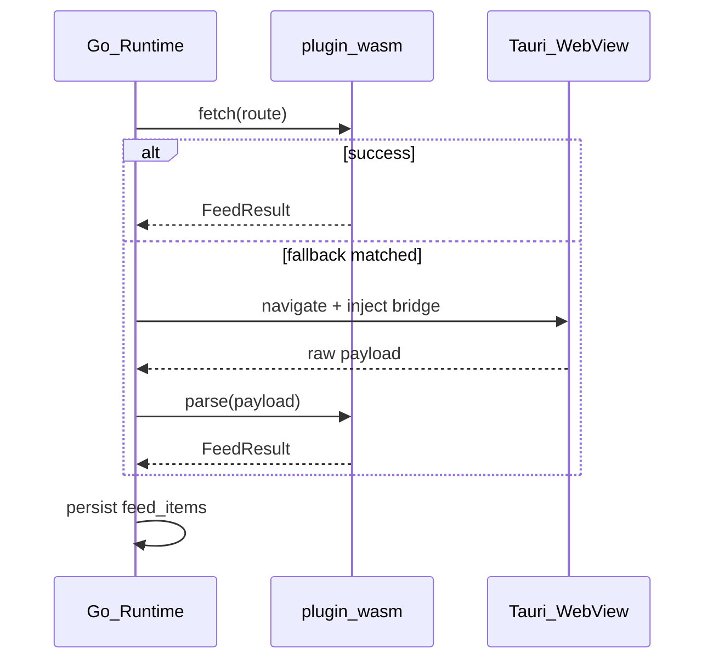

# Browser / Hybrid Execution (Phase 3 Preview)

Not implemented in Phase 1. Manifest fields are accepted and validated so official packages can ship forward-compatible configs.

## `config.executionMode`

| Value | Behavior |
|-------|----------|
| `wasm` | Default. Host HTTP + WASM `fetch` only. |
| `browser` | Tauri hidden WebView loads target site; `orbit-bridge.js` returns feed JSON. WASM not used for fetch. |
| `hybrid` | Browser obtains HTML/JSON; runtime calls WASM `action: "parse"` with raw payload. |

## `config.browser`

```json
{
  "browser": {
    "required": false,
    "fallbackOn": ["http_403", "captcha", "empty_items"]
  }
}
```

- `required: true` — skip WASM fetch; always use browser path (official signed plugins only).
- `fallbackOn` — after WASM/host HTTP failure, retry via WebView when error matches.

## Sequence (hybrid)



## Security gates (planned)

- `browser` / `hybrid` only for `meta.official` bundled plugins with signature verification.
- Bridge script allowlist per plugin id.
- No arbitrary URL navigation without manifest-declared origins.

## Dev fixtures (planned)

`orbit-plugins/devtools/browser-fixture/` — static HTML pages to test bridge extraction without production WebView.
